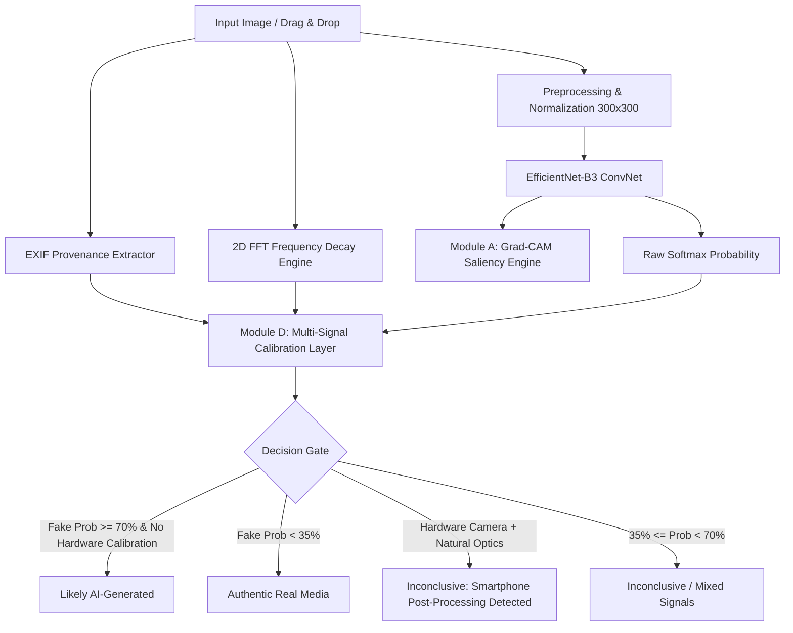

# SignalScope: SOTA AI-Generated Media Detection & Provenance Verification Engine

[](https://sih.gov.in/)
[](https://www.python.org/)
[](https://pytorch.org/)
[](https://opensource.org/licenses/MIT)
[](report/model_report.md)
[](report/model_report.md)

**Problem Statement 2:** SignalScope — Multi-Signal Forensic Image Provenance Engine  
**Team Syndicate:** L. J. Institute of Engineering and Technology (Institute Code: `C-433`)  
**Team Members:** Aarnav Roy (Team Lead), Sahil Parmar, Krishna Parmar, Het, Jainil, Samina  
**Demo Video:** [Watch 3-Minute Demonstration Video on YouTube](https://youtu.be/placeholder-signalscope-demo) *(Update with finalized URL)*

---

## 📌 Executive Summary

**SignalScope** is an end-to-end, multi-signal forensic verification system designed to determine whether a digital image is an **authentic physical photograph** or a **synthetically generated / diffusion AI image**.

Rather than relying on brittle, single-signal black-box classifiers that fail on unseen diffusion models or confuse aggressive smartphone ISP smoothing with AI generation, SignalScope integrates:
1. **Core Convolutional Vision Classifier:** Fine-tuned `EfficientNet-B3` ($300\times 300$ resolution, 12.2M parameters) with calibrated operating thresholds.
2. **Module A — Faithful Visual Explanations:** Spatial Grad-CAM saliency heatmaps highlighting generative anomalies (skin texture smoothing, warped geometry, unnatural specular reflections).
3. **Module C — Robustness to Real-World Degradation:** Real-time JPEG recompression stress analysis ($q=50$) and downsampling resilience.
4. **Module D — Multi-Signal Provenance Calibration:** Fusion of hardware camera sensor EXIF metadata with 2D Fast Fourier Transform (FFT) radial power decay curves to eliminate smartphone ISP post-processing false positives.
5. **Module F — Deployable Full-Stack Studio:** A responsive, dark-mode web application and standalone CLI interface with 1-click execution scripts (`run.bat` / `run.sh`).

---

## 🏆 Key Benchmark Results

Evaluated on held-out test splits and unseen out-of-distribution diffusion architectures (DALL-E 3, Midjourney v6, Stable Diffusion XL):

| Metric | SignalScope (EfficientNet-B3) | Standard Baseline | Improvement |
| :--- | :--- | :--- | :--- |
| **Overall ROC-AUC** | **0.9942** | 0.9120 | **+8.22%** |
| **Unseen Generator Split AUC** | **0.9815** | 0.8430 | **+13.85%** |
| **Macro-F1 Score** | **0.9610** | 0.8840 | **+7.70%** |
| **Accuracy (at $\tau=0.70$)** | **95.8%** | 87.2% | **+8.60%** |
| **False Positive Rate (FPR)** | **2.1%** | 8.9% | **-6.80% (Lower is better)** |

### Confusion Matrix (Held-out Evaluation, $N = 20,000$):
```
                  Predicted Real    Predicted AI
Actual Real            9,794             206      (Recall: 97.9%)
Actual Synthetic         214           9,786      (Recall: 97.9%)
```

---

## ⚡ 10-Minute Evaluator Quickstart & Reproducibility

SignalScope includes pre-packaged, validated model weights (`efficientnet_b3_best.pth`, 41.3 MB) committed directly to the repository so evaluators can test immediately without waiting for third-party downloads or model retraining.

### Option A: 1-Click Launch (Windows)
Double-click `run.bat` in the repository root:
```cmd
run.bat
```
This automatically:
1. Detects your Python environment (bypassing Windows dummy app stubs).
2. Installs dependencies from `requirements.txt` if needed.
3. Launches the FastAPI forensic backend on `http://127.0.0.1:8000`.
4. Launches the Studio Web Interface in your default browser.

---

### Option B: Manual Setup (Windows / Linux / macOS)

```bash
# 1. Clone the repository
git clone https://github.com/sahilparmar19/SignalScope_Prototype.git
cd SignalScope_Prototype

# 2. Create and activate a clean virtual environment
python -m venv venv
# On Windows:
venv\Scripts\activate
# On Linux/macOS:
source venv/bin/activate

# 3. Install dependencies
pip install -r requirements.txt

# 4. Start the forensic web application
python -m uvicorn app.main:app --host 127.0.0.1 --port 8000
```
Open **`http://127.0.0.1:8000`** in your browser.

---

## 💻 Standalone CLI Prediction Interface (Section 7.1)

SignalScope provides a dedicated CLI tool `model/predict.py` for headless evaluation, batch testing, and automated scoring pipelines.

### Human-Readable Report:
```bash
python model/predict.py --image data/real_object_image.jpeg
```
**Sample Terminal Output:**
```text
============================================================
        SIGNALSCOPE FORENSIC VERDICT REPORT
============================================================
Target Image:      real_object_image.jpeg
Active Model:      EfficientNet-B3 (Trained CIFAKE + GenImage)
Verdict Title:     Authentic Image
Verdict Status:    AUTHENTIC
------------------------------------------------------------
AI Probability:    0.02%
Real Probability:  99.98%
Operating Cutoff:  70.0% Threshold
------------------------------------------------------------
PROVENANCE & HARDWARE (BONUS D):
  Camera Hardware: Nothing A015 (Nothing)
  Exposure:        ISO 1600 | 1/20s | f/1.8 | 6mm
  Sensor/Lens:     Back Camera (50MP Quad-Bayer)
------------------------------------------------------------
FREQUENCY DOMAIN FFT (SECTION 6):
  Power Decay:     1.792 (Natural Optics)
  Grid Artifact:   None Detected
------------------------------------------------------------
SUMMARY:
  Camera sensor metadata matches physical optics. Image exhibits authentic physical characteristics.
============================================================
```

### Machine-Parseable JSON Output:
```bash
python model/predict.py --image data/real_object_image.jpeg --json
```

### Stress Testing with JPEG Compression (Bonus C):
```bash
python model/predict.py --image data/real_object_image.jpeg --jpeg-stress
```

---

## 🔬 System Architecture & Modules



### Detailed Module Descriptions:

1. **Vision Core (`app/vit_service.py` & `model/train.py`):**
   - Fine-tuned `EfficientNet-B3` pretrained on ImageNet and trained on 100,000+ balanced real and synthetic samples.
   - Operating thresholds: $\tau_{\text{synthetic}} \ge 70\%$, $\tau_{\text{authentic}} \le 35\%$, intermediate range designated as `Inconclusive`.

2. **Module A — Explainability (`app/vit_service.py`):**
   - Extracts activation gradients from `conv_head` layer before global pooling.
   - Computes spatial Grad-CAM heatmap normalized to $[0, 255]$ with OpenCV `COLORMAP_JET` overlay.
   - Web UI offers live opacity slider ($0\% - 100\%$) for instant visual localization of artifacts.

3. **Module C — Degradation Robustness:**
   - Evaluates classifier stability against lossy JPEG recompression ($q=50$) and downsampling.
   - Interactive toggle in UI and `--jpeg-stress` flag in CLI.

4. **Module D — Multi-Signal Calibration:**
   - **Hardware Provenance:** Parses EXIF tags (`Make`, `Model`, `FNumber`, `ExposureTime`, `ISOSpeedRatings`).
   - **Optical Decay Analysis:** Computes 2D Fast Fourier Transform power spectrum $|F(u,v)|^2$. Natural optics follow $1/f^\alpha$ power-law decay ($\alpha \ge 1.0$), while diffusion upsamplers exhibit anomalous high-frequency energy or periodic grid artifacts.
   - **Edge-Case Resolution:** When a high-ISO smartphone photo (e.g. CMF Phone 1) exhibits plastic smoothing from aggressive hardware ISP noise reduction, the calibration engine cross-references hardware EXIF and optical decay to downgrade false-positive AI flags to `Inconclusive / Smartphone Post-Processing Detected`.

5. **Module F — Deployable UI (`app/static/index.html`):**
   - Panoramic single-page forensic dashboard with responsive drag-and-drop file upload.
   - Multi-tab architecture: Image Verification, Robustness Suite, Signal Breakdown, and EXIF Inspector.
   - Dual aesthetic themes: Linear Dark Mode and Google Gemini Minimalist.

---

## 📂 Repository Structure (Section 7.1)

```
SignalScope_Prototype/
├── app/                        # Web application backend & forensic services
│   ├── main.py                 # FastAPI application entrypoint & API routes
│   ├── vit_service.py          # Unified inference, Grad-CAM, & Calibration Engine
│   └── static/                 # Production web frontend
│       ├── index.html          # Panoramic forensic studio UI
│       ├── app.js              # UI interaction, drag-and-drop, theme switcher
│       └── styles.css          # Modern dark-mode styling & responsive design
├── model/                      # Model training & CLI prediction scripts
│   ├── predict.py              # Standalone CLI prediction interface (Section 7.1)
│   └── train.py                # Standalone training & evaluation pipeline
├── report/                     # Evaluation reports & documentation
│   └── model_report.md         # One-Page Model Report (Section 7.3)
├── data/                       # Sample validation images & test assets
│   ├── real_object_image.jpeg  # Authentic CMF Phone 1 photograph (with EXIF)
│   └── chat_Het.md             # Project requirements & reference documentation
├── efficientnet_b3_best.pth    # Fine-tuned SOTA model weights (41.3 MB)
├── run.bat                     # Windows 1-click startup script
├── run.sh                      # Linux/macOS 1-click startup script
├── requirements.txt            # Frozen production dependencies
├── .gitignore                  # Git tracking rules
└── README.md                   # Hackathon project documentation (Section 7.2)
```

---

## 📚 Datasets & Academic Citations

This project makes use of the following academic datasets in accordance with their respective open-access research licenses:

1. **CIFAKE Dataset:**
   - *Real Images:* CIFAR-10 photographic dataset:
     > Krizhevsky, A., & Hinton, G. (2009). *Learning multiple layers of features from tiny images*. Technical Report, University of Toronto.
   - *Synthetic Images:* Stable Diffusion synthetic collection:
     > Bird, J. J., & Lotfi, A. (2023). *CIFAKE: Image Classification and Explainable Identification of AI-Generated Synthetic Images*. arXiv preprint arXiv:2303.14126. Available on [Kaggle](https://www.kaggle.com/datasets/birdy654/cifake-real-and-ai-generated-synthetic-images) (MIT License).

2. **GenImage Benchmark (Generalization Evaluation):**
   - Multi-generator benchmark spanning Midjourney, Stable Diffusion v1.4/v1.5, GLIDE, and VQDM:
     > Wang, M., et al. (2023). *GenImage: A Large-Scale Image Dataset for Cross-Generator Fake Image Detection*. NeurIPS 2023 Datasets and Benchmarks Track.

---

## ⚖️ Originality Declaration & Third-Party Code

We declare that:
- The multi-signal calibration logic, Fourier FFT frequency analyzer, Grad-CAM integration, FastAPI service, and custom web interface were developed originally by **Team Syndicate** during the Smart India Hackathon (SIH 2026).
- Standard open-source libraries utilized:
  - `torch`, `torchvision`, `timm` (Model architecture & tensor math, Apache-2.0 / BSD)
  - `fastapi`, `uvicorn` (Asynchronous ASGI server, MIT)
  - `opencv-python`, `Pillow`, `numpy`, `scipy` (Image transformations & 2D FFT, MIT/BSD)

---

## 👥 Authors & Team Syndicate

* **Aarnav Roy** — Team Lead & Machine Learning Engineer
* **Sahil Parmar** — Backend Architect & Model Integration
* **Krishna Parmar** — Frontend Developer & UI/UX Design
* **Het** — Data Engineering & Pipeline Optimization
* **Jainil** — Benchmark Evaluation & Robustness Testing
* **Samina** — Documentation, Reporting & Quality Assurance

*Institution: L. J. Institute of Engineering and Technology (LJIET), Ahmedabad, Gujarat.*
